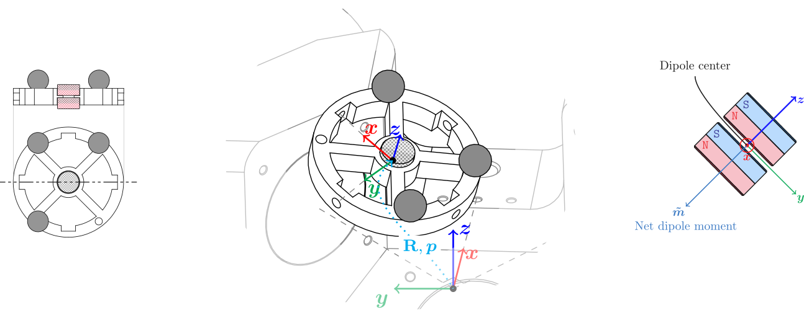
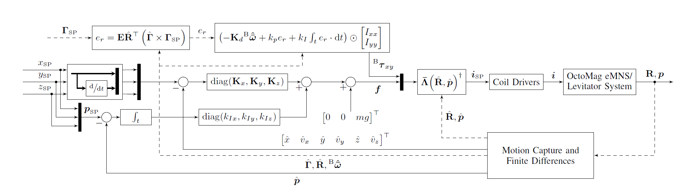

<div align="center">
<h1>Remote Magnetic Levitation Using Reduced Attitude Control and Parametric Field Models</h1>

<h4>Neelaksh Singh<sup>1</sup>, Jasan Zughaibi<sup>1</sup>, Denis Von Arx<sup>1</sup>, Michael M&uumlhlebach<sup>2</sup>, and Bradley J. Nelson<sup>1</sup><br></h4>
<sup>1</sup>Institute for Robotics and Intelligent Systems, ETH Z&uumlrich, Switzerland<br>
<sup>2</sup>Learning and Dynamical Systems Group, Max Planck Institute for Intelligent Systems, T&uumlbingen, Germany<br>
</div>

<p align="center">
  
  
</p>

## Package Structure :toolbox:
```
oct_levitation
├─── config/
│    ├── controller_params.yaml              : Parameters for the levitation controller
│    ├── experiment_analysis_params.yaml     : Parameters for recording and plotting experiment data
│    ├── general_params.yaml                 : Specifies the selected rigid body for levitation
│    │
│    ├── rqt_multiplot/                      : rqt_multiplot configuration files for live plotting experiment data
│    │
│    └── rviz/                               : RViz configuration files for visualizing states and inputs of the levitated rigid body
│
├─── docs/
│    └── rtprio_permissions.md               : Instructions to set real-time permissions for the controller node on Linux
│
├─── launch/
│    ├── control_pipeline_base.launch         : Launchfile for drivers and Vicon interface
│    ├── experiment_analysis.launch           : Launchfile for recorded data plotting script
│    ├── experiment_recording.launch          : Launchfile for recording experiment data
│    └── xyz_normal_control_com_wrench.launch : Overall launchfile for the controller
│
├─── msg/                                   : Custom ROS message definitions
│
├─── scripts/
│    ├── xyz_reduced_attitude_single_dipole.py : Main controller script with LQR, allocation, and reduced attitude control
│    │
│    └── utils/
│         ├── experiment_analysis.py              : Extracts and plots recorded experiment data for analysis
│         ├── experiment_data_summarizer.py       : Summarizes key details from recorded experiments into a text file
│         ├── experiment_recorder.py              : Records experiment data into a ROS bag
│         └── rviz_visualizations.py              : Publishes RViz visualizations for the levitated rigid body
│
└─── src/
     └── oct_levitation/
          ├── common.py                    : Common definitions and utilities
          ├── control_node.py              : ROS node base for the levitation controller
          ├── geometry.py                  : Geometry functions and utilities
          ├── geometry_jit.py              : JIT-compiled geometry functions for real-time performance
          ├── mechanical.py                : Classes and functions related to rigid body’s mechanical and magnetic properties
          ├── numerical.py                 : Common numerical methods and utilities
          ├── plotting.py                  : Plotting functions used for experiment data analysis
          ├── processing_utils.py          : Data extraction utilities
          ├── rigid_bodies.py              : Definitions of different rigid bodies used in experiments
          └── trajectories.py              : Functions defining trajectories used in experiments

```

## Installation Instructions :hammer_and_wrench:
This package has been tested on Ubuntu 20.04 with ROS Noetic.
The rest of this section assumes that you have a working ROS Noetic installation and the knowledge required to create and build a ROS workspace.

### Dependencies :package:
This package depends on the following ROS packages for building and running the levitation controller:

#### Vicon Bridge
This package is required to receive pose data from the Vicon motion capture system.
```bash
cd ~/catkin_ws/src
git clone https://github.com/ethz-asl/vicon_bridge.git
```
Connect the PC running the Vicon system to your computer with an ethernet connection and just run a Vicon tracking software.
If you use another motion capture system, you must install its corresponding software interface and modify the launch files, as well as the topics in the controller node to receive pose data from that system.

#### Magnetic Manipulation Library by MSRL
MSRL provides a ROS package for modelling electromagnetic manipulation systems in the Tesla Core collection of packages which can be found here: https://github.com/ethz-msrl/Tesla_core_public.git.
The implementation of the Multi-Pole Expansion Model used in this package can be found at in the [`Tesla_core_public/mag_control/mpem`](https://github.com/ethz-msrl/Tesla_core_public/tree/master/mag_control/mpem) directory.
It also contains instructions for creating calibration datasets and running the model fitting procedure.
Simply clone Tesla Core into your ROS workspace:
```bash
cd ~/catkin_ws/src
git clone https://github.com/ethz-msrl/Tesla_core_public.git
```

### Clone and Build :construction:
Simply clone this repository into your ROS workspace's source directory and build it as follows:
```bash
cd ~/catkin_ws/src
git clone git@github.com:NeelakshSingh/oct_levitation.git
catkin build oct_levitation
```
The `setup.py` file in the package root contains all necessary python packages which will be installed during the build process.
Give real-time permissions to the controller node by following the instructions in `docs/rtprio_permissions.md`.
To make complete use of the experiment analysis script, install `xterm`:
```bash
sudo apt-get install xterm
``` 

### Hardware Interface to eMNS :electric_plug:
To interface with the OctoMag eMNS hardware, you need to install the proprietary driver software provided by MagnebotiX.
Since it is not publicly available, we cannot provide direct installation instructions here.
However, note that the codebase provided can be made to work with any eMNS provided that a suitable hardware interface node is implemented.
The driver software must interface with ROS by subscribing to a topic for receiving desired coil currents which is published by the controller node.

This implementation roughly works by publishing currents over a topic using the `VectorStamped` message defined in this package.
One can program a hardware interface node which operates their eMNS driver and subscribes to this topic to receive the desired coil currents and send them to the eMNS coil drivers accordingly.
The initialization of this interface is done in the following line in the controller base class defined in `src/oct_levitation/control_node.py`:
```python
self.desired_currents_msg, self.currents_publisher, self.publish_currents_impl, shutdown_hook = init_system("JECB", self.__HARDWARE_CONNECTED, coil_nrs=self.__ACTIVE_DRIVERS)

```
The `self.currents_publisher` is the topic Publisher and `self.publish_currents_impl` is a function which takes in the message and publishes it using the publisher. 
This interface is specific to OctoMag and the user can feel free to modify all concerned parts of the code to suit their hardware interface needs.
Finally, note the following lines in the launchfile `launch/control_pipeline_base.launch`:
```xml
<group if="$(hardware_connected)">
  <include file="$(find oct_levitation)/launch/tnb_mns_driver.launch"/>
</group>
```
This line mentions `tnb_mns_driver.launch`, which used to launch the proprietary OctoMag driver software not included in this repository.
Therefore, you must remove/replace this line as appropriate to launch your own hardware interface node otherwise the main launchfile `xyz_normal_control_com_wrench.launch` will fail to run.

## Levitate a Rigid Body :magic_wand:
Follow these steps to run the levitation controller on a rigid body with a single magnetic dipole:

1. Describe the mechanical properties of your levitator in `src/rigid_bodies.py`. Objects used in the experiments included in the research paper and the video are already defined there for reference. Make sure to properly define the orientation of each magnet in the stack consisting of the dipole. Give the levitator a unique name and register it with the functions provided.
2. Modify `config/general_params.yaml` to select your rigid body by its unique name.
3. Make sure that you are able to receive pose data from your motion capture system in ROS. For Vicon, simply run the tracking software in the Vicon PC connected to your computer via ethernet.
4. Make sure that your hardware interface node for the eMNS is running and is able to receive coil current commands on the driver via the appropriate ROS topic and communication interface.
5. Launch the controller with the following command and with the levitator kept near the desired starting position:
```bash
roslaunch oct_levitation xyz_normal_control_com_wrench.launch sim:=false hardware_connected:=true description:="one or two lines about the experiment"
```
The `sim` argument was defined as a part of the framework within `control_node.py` to allow sending current commands to a simulator instead.
It also makes sure that the coil driver stays switched off throughout the node's execution.
Setting `hardware_connected` to true allows the service call for switching the coil driver on only if `sim` is false.
The `description` argument is mandatory and was implemented to identify the purpose of each experiment among hundreds of recorded trials.

6. Check the `data_subfolder` argument defined in the launchfile, that is the subfolder which can be used to categorize experiments for each rigid body. By default, the experiment data recorded runs automatically and saves data in the relative path `oct_levitation/data/experiment_data/<rigid_body_name>/<data_subfolder>/`. Key details are then plotted by running the experiment analysis launchfile. In this case, for example:
```bash
roslaunch oct_levitation experiment_analysis.launch data_subfolder:=xyz_normal_control
```
Note that all scripts make use of the rigid body name to find the right data files so make sure that it is correctly defined in `general_params.yaml`.
The experiment analysis script extracts and plots data, and opens the editor of your choice (nano in xterm by default) so that you can note down key observations from the experiment.
These behaviors can be modified using the parameters defined in the launchfiles and the rosparam files inside the `config/` directory.

## The System in Action :clapper:
<p align="center">
  <a href="https://youtu.be/2jLZ28T4uew?si=ZkWapzc_8Rndw5Ex">
    
  </a>
</p>

<p align="center">
  🎥 <a href="https://youtu.be/2jLZ28T4uew?si=ZkWapzc_8Rndw5Ex">Watch the demo on YouTube</a>
</p>


## BibTex Citation :books:

```bibtex
@article{neelaksh2025remote_maglev,
  title         = {Remote Magnetic Levitation Using Reduced Attitude Control and Parametric Field Models},
  author        = {Singh, Neelaksh and Zughaibi, Jasan and von Arx, Denis and Nelson, Bradley J. and Muehlebach, Michael},
  journal       = {arXiv preprint arXiv:2511.XXXXX},
  year          = {2025},
  url           = {https://arxiv.org/abs/2511.XXXXX}
}
```

## Acknowledgements :handshake:
We thank Prof. Peter Berkleman for providing valuable insight on magnetic levitation systems based on his extensive experience in developing magnetic levitation systems. We also thank MagnebotiX AG for technical support with the OctoMag eMNS hardware. We gratefully acknowledge the support of the Max Planck Institute for Intelligent Systems, Tübingen, Germany, for providing access to their high-frequency motion capture system used in our experiments. A special thanks to Thomas Steinbrenner and Felix Grüninger for their help with hardware and electronics design and fabrication essential to the project. Finally, we thank the authors of all open-source software packages used in this work as mentioned in the installation instructions.